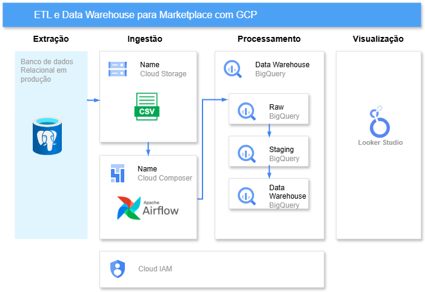
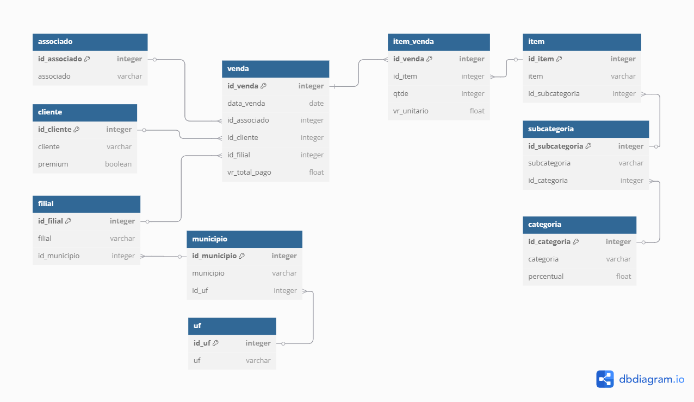
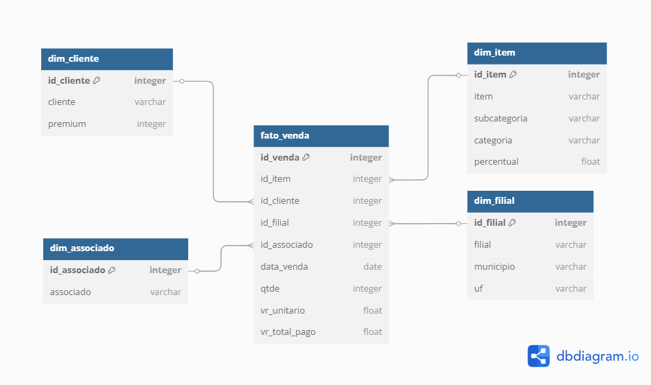

# 📊 Data Warehouse – ETL e Comissionamento para Marketplace usando Google Cloud Platform

## 📌 Descrição do Projeto

Projeto exploratório voltado à construção de um pipeline de dados para automatizar o cálculo de comissões em um ambiente de marketplace, utilizando serviços do ecossistema Google Cloud Platform (GCP), como BigQuery, Cloud Storage e Cloud Composer. O projeto envolveu a aplicação de modelagem dimensional no formato star schema, além de processos de data cleansing, com tratamento de valores nulos, remoção de duplicidades e padronização de atributos. Foram desenvolvidas queries SQL otimizadas e notebooks integrados em Python e SQL para manipulação e transformação dos dados. A orquestração foi realizada com Apache Airflow, garantindo a automação, monitoramento e rastreabilidade de toda a carga de dados.

O diagrama a seguir apresenta uma visão geral do fluxo de execução adotado.

A imagem abaixo representa o relacionamento entre as tabelas exportadas do banco de produção PostgreSQL.

## 🔧 Tecnologias Utilizadas
- Google Cloud Platform (GCP): 
    - BigQuery 
    - Cloud Storage
    - Cloud Composer
    - Looker Studio
- Python
- Airflow

## 🛠️ Implementação

O projeto está divido em 4 notebooks, sendo eles:

[1. Importação dos dados](notebooks/1.Importacao_dados.ipynb)

Este script em Python automatiza o processo de leitura de arquivos .csv armazenados no Cloud Storage, realiza transformações necessárias e carrega os dados em tabelas no BigQuery. Trata-se de uma alternativa manual à orquestração via Airflow, ideal para cenários em que o uso do Airflow não é viável ou desejado.

No entanto, a inserção dos dados foi realizada por meio da DAG [Ingestão de Dados](dag/ingestao_dados.py), orquestrada com o Cloud Composer, que automatiza a criação das tabelas no BigQuery e o carregamento dos dados.

[2. Limpeza dos dados](notebooks/2.limpeza_dados.ipynb)

O processo de limpeza de dados envolve a remoção de linhas duplicadas e a reorganização das relações entre as tabelas, garantindo a consistência e integridade dos dados após a exclusão.

[3. Modelagem Dimensional](notebooks/3.modelagem_multidimensional.ipynb)

A modelagem dimensional é uma abordagem de estruturação de dados voltada para facilitar consultas analíticas e gerar insights de forma eficiente. No projeto, utilizei o modelo estrela (star schema), organizando os dados em tabelas fato, que centralizam os eventos transacionais (como vendas e comissões), e tabelas dimensão, que armazenam informações descritivas relacionadas (como cliente, produto e categoria). Essa modelagem permite maior desempenho em consultas e é amplamente adotada em projetos de Data Warehousing por sua simplicidade, escalabilidade e facilidade de entendimento por usuários de negócio.

Foram criadas as dimensões Cliente, Filial, Associado e Item, pois essas entidades fornecem contexto para as análises de vendas. A tabela Fato_Venda centraliza os dados, armazenando métricas como valores de venda, quantidade de produtos e datas das transações. Essa estrutura permite análises detalhadas de desempenho por diferentes perspectivas, como comportamento dos clientes, impacto dos parceiros e evolução das vendas ao longo do tempo

A imagem abaixo representa os dados após procedimento de modelagem dimensional.

[4. View e métricas](notebooks/4.views_metricas.ipynb)

Foram criadas diversas views com o objetivo de facilitar a análise dos dados, incluindo:

- Consulta de vendas com todas as informações agregadas
- Vendas por cliente
- Vendas por localização e cliente
- Consulta por produto, subcategoria e categoria
- Vendas por categoria ao longo dos anos
- Vendas diárias
- Cálculo de comissões por associado

Além disso, foi desenvolvida uma procedure que realiza o cálculo da comissão bruta e líquida por associado, de forma mensal.

## 📊  Painel de Vendas e Comissões

[em construção]
